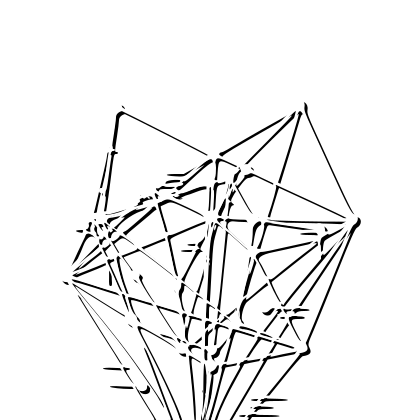

<p align="center">
  
</p>

# Holographic Memory System (HMS)

[](https://opensource.org/licenses/Apache-2.0)
[](https://nodejs.org/api/n-api.html)
[](https://www.rust-lang.org/)

A high-performance **Holographic Memory System (HMS)** for Node.js, powered by Rust. This library implements **Vector Symbolic Architectures (VSA)** using **Binary Spatter Code (BSC)** and **Sparse Distributed Representations (SDR)** to enable semantic search, analogical reasoning, and associative memory at scale.

## 🚀 Features

- **Hybrid Retrieval Architecture**: 
  - **NSG (Navigable Small World)**: Fast proximity graph for approximate nearest neighbors.
  - **IVF (Inverted File)**: Coarse-grained quantization for large datasets.
  - **Sparse Inverted Index**: Term-based retrieval for high-sparsity queries.
- **Symbolic Operations**: Native bitwise **Binding (XOR)**, **Bundling (Majority Rule)**, and **Permutation (Cyclic Shift)**.
- **Performance Optimized**:
  - **O(1) Resolution**: Cached physical location lookups for instant ID retrieval.
  - **FxHash Backend**: Ultra-fast non-cryptographic hashing for all retrieval collections.
  - **O(N) Selection**: Linear-time candidate pruning using `select_nth_unstable`.
- **Persistent Storage**: Integrated `sled` (key-value) and custom `Arena` (binary) for ACID-compliant persistence.
- **Node.js Bindings**: High-efficiency N-API implementation with asynchronous worker thread execution.

## 🔌 Integrations

HMS is available as both a Node.js package and a high-performance Rust crate.

### Node.js (N-API)
```bash
npm install @hms/native
```

### Rust (Crates.io)
Add to your `Cargo.toml`:
```toml
[dependencies]
hms-core = "0.2"
```

## 🏗 Core Architecture

HMS is designed for local-first intelligence, combining advanced research in Hyperdimensional Computing with efficient retrieval algorithms.

- **Advanced Search**: Implements the **NSG (Navigable Small World)** algorithm, offering high search efficiency and index compactness.
- **Adaptive Routing**: Employs a retrieval strategy that dynamically switches between graph-based, quantized, and inverted indexing based on dataset statistics.
- **Neuro-Symbolic VSA**: A robust implementation of **Binary Spatter Code (BSC)**, enabling relational logic $(A \otimes B)$ combined with the associative matching of high-dimensional vector spaces.
- **Efficient Data Path**: Engineered with a zero-copy N-API interface, $O(1)$ ID resolution, and hardware-aware optimizations for high single-node throughput.

## 🎯 Use Cases

### 1. Semantic Search & Local RAG
Store text fragments or documents as hypervectors. While HMS uses high-speed **Deterministic 3-Gram Encoding** for lexical similarity, it also supports **LLM Integration**. Ingest SOTA embeddings from models like GPT-4 or Llama-3 (via `Float32Array`) and use HMS as your high-performance retrieval and reasoning layer.

### 2. Symbolic Knowledge Graphs (Holographic Graph)
Encode relational triplets `(Subject, Predicate, Object)` into a single hypervector. 
- **Querying**: "What is the capital of France?" becomes `(France ⊗ Capital) ⊛ ?`.
- **Analogies**: Solve `King : Man :: ? : Woman` via holographic vector arithmetic.

### 3. Real-Time Sequence Pattern Matching
Use **Cyclic Permutations** to represent order. Ideal for temporal data like time-series patterns, sentence structures, or user behavior trajectories. Querying for a sequence is as fast as querying for a single item.

### 4. Concept Synthesis & Abstraction
Use the `synthesizeConcepts` method to identify "abstractions" within your memory. HMS clusters similar hypervectors and generates a **centroid** that represents the common features of the cluster—essentially "dreaming" up generalized categories from raw data.

### 5. Explainable Vector Decomposition
Hypervectors in HMS are **Distributed Representations**. You can use `analyzeComponents` to decompose a complex bundled vector back into its constituent symbols, providing a "reasoning" trace for why a certain item was retrieved.

## 🧠 Core Concepts

### Hyperdimensional Computing (HDC)
Traditional AI uses deep vectors (weights). HDC uses high-dimensional (e.g., 10,000+), sparse vectors where information is "holographically" distributed across every dimension. 

- **Binding (⊗)**: Combines two vectors into a new, orthogonal vector representing their relationship. Reversible.
- **Bundling (⊛)**: Combines multiple vectors into a single vector that retains similarity to all its components.
- **Permutation (Π)**: Represents sequence and structure by shifting bits.

## 🛠 Quick Start

```javascript
const { HolographicMemorySystem } = require('@hms/native');

async function main() {
  // Initialize with 10,000 dimensions
  const hms = new HolographicMemorySystem(10000, './hms_storage');

  // Memorize associations
  await hms.memorizeText('paris', 'capital of france');
  await hms.memorizeText('berlin', 'capital of germany');

  // Semantic Query
  const results = await hms.query('What is the capital of germany?', 1);
  console.log('Match:', results[0]); // { id: 'berlin', similarity: 0.85 }

  // Analogical Reasoning
  const analogy = await hms.findAnalogy('france', 'paris', 'germany');
  console.log('Result:', analogy[0].id); // 'berlin'
}

main().catch(console.error);
```

## 🔧 Development

### Build Environment
To bypass global permission issues and optimize build performance, use the following configuration:

```bash
# Set local cargo home and target directory
export CARGO_HOME=$(pwd)/.cargo_home
export CARGO_TARGET_DIR=/Volumes/C/target

# Build
npm run build
```

### Testing
```bash
# Run the 67+ unit and integration tests
export CARGO_HOME=$(pwd)/.cargo_home
export CARGO_TARGET_DIR=/Volumes/C/target
cargo test --lib
```

## 📄 License
This project is licensed under the Apache License, Version 2.0 - see the [LICENSE](LICENSE) file for details.
